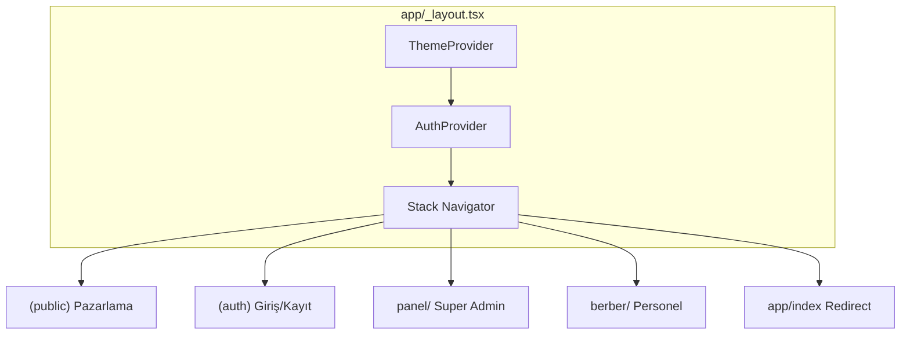

# Ustura Frontend — Teknik Referans ve Bileşen Kataloğu

Bu belge **Ustura_Frontend** kod tabanının mimarisini, yönlendirmeyi (Expo Router), veri katmanını ve `components/` altındaki tüm TypeScript/TSX modüllerini tek yerde toplar. Onboarding, kod incelemesi ve refaktör için referans amaçlıdır.

---

## 1. Özet

| Öğe | Açıklama |
|-----|----------|
| **Çatı** | [Expo SDK 54](https://docs.expo.dev/) + [Expo Router 6](https://docs.expo.dev/router/introduction/) (dosya tabanlı yönlendirme) |
| **UI** | React 19, React Native 0.81, **NativeWind 4** (`className`, `global.css`) |
| **Durum** | `AuthContext` merkezi oturum; modül içi `use-*` kancaları |
| **API** | `services/api.ts` — JWT yenileme, `configureApiAuth` ile `AuthContext` bağlantısı |
| **Yol takma adı** | `@/*` → proje kökü (`tsconfig.json`) |

Kök giriş: `app/_layout.tsx` — `ThemeProvider` → `AuthProvider` → `Stack` + `FlashMessage`.

---

## 2. Teknoloji yığını (package.json)

- **Yönlendirme / navigasyon:** `expo-router`, `@react-navigation/native`, bottom tabs
- **Medya / etkileşim:** `expo-image`, `expo-linear-gradient`, `react-native-reanimated`, `react-native-gesture-handler`
- **Grafik (raporlar):** `@shopify/react-native-skia`, `victory-native` — web için `*.web.tsx`, native için `*.native.tsx` ikilileri
- **PDF / paylaşım:** `jspdf`, `expo-print`, `expo-sharing`
- **Bildirim:** `react-native-flash-message`
- **Kalite:** TypeScript strict, ESLint (expo config), Prettier + Tailwind sınıf sıralaması

---

## 3. Uygulama mimarisi

### 3.1. Yüksek seviye akış

### 3.2. Rol bazlı kabuklar

| Rol | URL kökü | Düzen dosyası | Koruma |
|-----|-----------|----------------|--------|
| **Misafir / müşteri** | `/(public)`, `/giris`, `/kayit` | `(public)/_layout.tsx`, `(auth)/_layout.tsx` | `AuthGuard` (seçili sayfalar) |
| **Super admin** | `/panel/*` | `app/panel/_layout.tsx` | `role === 'super_admin'` değilse → `/super-admin/giris` |
| **Salon personeli** | `/berber/*` | `app/berber/_layout.tsx` | `owner \| barber \| receptionist`; zorunlu şifre değişiminde `/personel/sifre-degistir` |

### 3.3. Bileşen organizasyonu

- **`components/ui`:** Yeniden kullanılabilir atomlar (Button, Input, Modal…)
- **`components/layout`:** Ortak kabuk, Navbar, Footer, oturum kartı, `AuthGuard`
- **`components/landing`**, **`hakkimizda`**, **`hizmetler`**, **`kuaforler`:** Pazarlama ve liste / vitrin
- **`components/wizard`:** Randevu rezervasyon sihirbazı adımları
- **`components/auth/*`:** Rol bazlı giriş ekranları ve formlar
- **`components/panel/barber-admin`:** Berber paneli (dashboard, rezervasyon, çizelge, ayarlar, personel, paketler)
- **`components/panel/super-admin`:** Platform yönetimi (salonlar, kullanıcılar, paketler, raporlar, loglar, bildirimler…)
- **`components/panel/*` (ortak):** Eski/ortak panel parçaları (`CalendarView`, `StaffList`, `WorkingHoursEditor` vb.)

Tipik modül içi dosyalar:

| Dosya adı | Rol |
|-----------|-----|
| `presentation.ts` | Stil sınıfları, spacing, metin sabitleri (saf veri / fonksiyon) |
| `use-*.ts` | Veri çekme, form veya liste durumu |
| `types.ts` | TypeScript arayüzleri |
| `data.ts` / `*.data.ts` | Mock veya statik seed verisi |
| `navigation.ts` | Rota sabitleri veya adım geçişleri |

---

## 4. Rota haritası (`app/`)

Grup klasörleri URL’de görünmez: `(public)`, `(auth)`, `(panel)` yalnızca dosya sistemini düzenler.

| Dosya | URL (tipik) | Ana bileşen / not |
|-------|----------------|-------------------|
| `app/index.tsx` | `/` | `Redirect` → `/(public)` |
| `app/_layout.tsx` | — | Kök sağlayıcılar + Stack |
| `app/(public)/_layout.tsx` | — | `Slot` (public sayfa kabuğu) |
| `app/(public)/index.tsx` | `/` | Açılış / landing |
| `app/(public)/hakkimizda.tsx` | `/hakkimizda` | Hakkımızda |
| `app/(public)/hizmetler.tsx` | `/hizmetler` | Hizmetler |
| `app/(public)/kuaforler.tsx` | `/kuaforler` | Kuaför listesi |
| `app/(public)/kuaforler/[salonId].tsx` | `/kuaforler/:id` | `SalonStorefrontPage` — vitrin |
| `app/(public)/randevu.tsx` | `/randevu` | Rezervasyon sihirbazı |
| `app/(public)/randevularim.tsx` | `/randevularim` | Müşteri randevuları (`AuthGuard`) |
| `app/(public)/gizlilik-politikasi.tsx` | `/gizlilik-politikasi` | Yasal metin |
| `app/(public)/kullanim-kosullari.tsx` | `/kullanim-kosullari` | Yasal metin |
| `app/(auth)/_layout.tsx` | — | Auth grubu |
| `app/(auth)/giris.tsx` | `/giris` | Müşteri girişi |
| `app/(auth)/kayit.tsx` | `/kayit` | Müşteri kaydı |
| `app/(auth)/super-admin/index.tsx` | `/super-admin` | Süper admin yönlendirme |
| `app/(auth)/super-admin/giris.tsx` | `/super-admin/giris` | Süper admin girişi |
| `app/(auth)/personel/index.tsx` | `/personel` | Personel yönlendirme |
| `app/(auth)/personel/giris.tsx` | `/personel/giris` | Personel girişi |
| `app/(auth)/personel/sifre-degistir.tsx` | `/personel/sifre-degistir` | Zorunlu şifre değişimi |
| `app/panel/_layout.tsx` | `/panel/*` | Super admin sidebar + `Slot` |
| `app/panel/index.tsx` | `/panel` | Dashboard |
| `app/panel/salonlar/index.tsx` | `/panel/salonlar` | Salon listesi |
| `app/panel/salonlar/[salonId].tsx` | `/panel/salonlar/:id` | Salon profil düzenleme |
| `app/panel/kullanicilar/index.tsx` | `/panel/kullanicilar` | Kullanıcılar |
| `app/panel/kullanicilar/[userId].tsx` | `/panel/kullanicilar/:id` | Kullanıcı profili |
| `app/panel/paketler/index.tsx` | `/panel/paketler` | Paketler |
| `app/panel/paketler/[packageId].tsx` | `/panel/paketler/:id` | Paket detayı |
| `app/panel/basvurular.tsx` | `/panel/basvurular` | Başvurular |
| `app/panel/bildirimler.tsx` | `/panel/bildirimler` | Bildirimler |
| `app/panel/raporlar.tsx` | `/panel/raporlar` | Raporlar |
| `app/panel/loglar.tsx` | `/panel/loglar` | Audit loglar |
| `app/panel/personel.tsx` | `/panel/personel` | Panel personel (super admin) |
| `app/panel/ayarlar.tsx` | `/panel/ayarlar` | Platform ayarları |
| `app/(panel)/_layout.tsx` | — | `(panel)` grubu (ör. ayarlar yedek yolu) |
| `app/(panel)/index.tsx` | — | Panel alt yönlendirme |
| `app/(panel)/ayarlar.tsx` | — | Ayarlar (grup) |
| `app/(panel)/personel.tsx` | — | Personel (grup) |
| `app/berber/_layout.tsx` | `/berber/*` | Berber sidebar |
| `app/berber/index.tsx` | `/berber` | Berber dashboard |
| `app/berber/randevular.tsx` | `/berber/randevular` | Rezervasyonlar |
| `app/berber/bildirimler.tsx` | `/berber/bildirimler` | Bildirimler |
| `app/berber/personel.tsx` | `/berber/personel` | Personel yönetimi |
| `app/berber/paketler.tsx` | `/berber/paketler` | Abonelik / paketler |
| `app/berber/ayarlar.tsx` | `/berber/ayarlar` | Salon ayarları |

**Rota sabitleri:** `constants/routes.ts` — `panelRoutes`, `staffRoutes`, `publicRoutes`, `authRoutes`, `buildPublicSalonDetailRoute` vb.

---

## 5. Kimlik doğrulama

- **`contexts/AuthContext.tsx`:** Oturum, token yenileme, müşteri / süper admin / personel giriş ve kayıt, Google web girişi, `configureApiAuth` ile API bağlama.
- **`hooks/use-auth.ts`:** Context’e ince sarmalayıcı.
- **`components/layout/AuthGuard.tsx`:** Oturum yoksa `loginRedirect` (varsayılan `/giris`).
- **`hooks/use-role-guard.ts`:** Rol kontrolü için yardımcı.

---

## 6. API ve servisler (`services/`)

| Servis | Sorumluluk |
|--------|------------|
| `api.ts` | `apiRequest`, base URL, auth header, 401 yeniden deneme |
| `auth.service.ts` | Giriş, kayıt, token yenileme, şifre değişimi |
| `google-auth.service.ts` | Web Google Identity |
| `salon.service.ts` | Salon CRUD, vitrin, medya uçları |
| `salon-service.service.ts` | Salon içi hizmet kalemleri |
| `staff.service.ts` | Personel API |
| `user.service.ts` | Kullanıcı profili / admin kullanıcı |
| `reservation.service.ts` | Rezervasyonlar |
| `slot.service.ts` | Müsait slotlar |
| `notification.service.ts` | Bildirimler |
| `package.service.ts` | Paket ve abonelik |
| `platform-admin.service.ts` | Platform admin toplu işlemler |
| `platform-settings.service.ts` | Platform ayarları |
| `reports.service.ts` | Rapor verileri |
| `audit-log.service.ts` | Denetim logları |

**Ortam:** `constants/api.ts` — backend tabanı (ör. `EXPO_PUBLIC_API_URL`).

---

## 7. React hook’ları (`hooks/`)

| Dosya | Kullanım |
|-------|----------|
| `use-auth.ts` | Oturum ve kullanıcı |
| `use-role-guard.ts` | Rota veya ekran koruma |
| `use-salons.ts` | Salon listesi / detay verisi |
| `use-staff.ts` | Personel listesi |
| `use-slots.ts` | Slot seçimi |
| `use-reservations.ts` | Rezervasyon verisi |
| `use-my-bookings.ts` | Müşteri randevuları |
| `use-booking-entry.ts` | Sihirbaza giriş parametreleri |
| `use-salon-storefront.ts` | Genel vitrin sayfası verisi |
| `use-theme-color.ts` / `use-color-scheme.ts` | Tema / sistem şeması |

---

## 8. Bağlam, sabitler, yardımcılar, tipler

- **Bağlam:** `contexts/ThemeContext.tsx` — açık/koyu, NativeWind değişkenleri.
- **Sabitler:** `constants/routes.ts`, `theme.ts`, `typography.ts`, `spacing.ts`, `nativewind-theme.ts`, `mock-auth.ts`.
- **Yardımcılar:** `utils/cn.ts`, `date.ts`, `slot.ts`, `token.ts`, `validation.ts`, `flash.ts`, `color.ts`, `matches-query.ts`, `legal-pdf.ts`.
- **Tipler:** `types/api.types.ts`, `salon.types.ts`, `staff.types.ts`, `reservation.types.ts`, `user.types.ts`, `jspdf-es.d.ts`.

---

## 9. Modül bazlı bileşen kataloğu

Aşağıda her alt paket için **giriş bileşenleri** ve klasörün amacı özetlenir. **Tam dosya listesi Ek A’dadır.**

### 9.1. `components/auth/customer-access/`

Müşteri giriş ve kayıt: `CustomerAccessScreen`, `CustomerRegistrationScreen`, `CustomerAccessShell`, Google düğmesi, form alanları, `CustomerRoleModal`, `use-customer-access.ts`, `use-customer-registration.ts`, `navigation.ts`, `presentation.ts`.

### 9.2. `components/auth/shared/`

Ortak auth çerçevesi: `AuthPageFrame`, `AuthCredentialField`, `AuthSelectField`, `AuthStatusNotice`, `use-auth-access-theme.ts`.

### 9.3. `components/auth/staff-access/`

Personel girişi: `StaffAccessScreen`, `StaffAccessCard`, `StaffAccessIdentity`, salon seçim modali, `StaffPasswordChangeScreen`, `use-staff-access.ts`.

### 9.4. `components/auth/super-admin-access/`

Süper admin konsol girişi: `SuperAdminAccessScreen`, kart, alan, göstergeler, yasal footer, `use-super-admin-access.ts`.

### 9.5. `components/customer-bookings/`

Müşteri randevu listesi ve detay: `CustomerBookingsPage`, sekmeler, liste öğesi, durum rozeti, detay modalı, `use-customer-bookings.ts`.

### 9.6. `components/hakkimizda/` — `components/hizmetler/`

Statik / pazarlama içerik: `AboutContent`, `PhoneMockup`; `AudienceSwitcher`, `FeatureShowcase`, `ServiceCard`.

### 9.7. `components/kuaforler/`

Liste: `FilterBar`, `PaginationBar`, `PromoBanner`, `SalonCard`, `presentation.ts`, `salon-listing.ts`.

### 9.8. `components/kuaforler/storefront/`

Salon vitrin sayfası: `SalonStorefrontPage`, `StorefrontHero`, `StorefrontSection`, `StorefrontServices`, `StorefrontTeam`, `StorefrontTeamCard`, `StorefrontSidebar`, `presentation.ts`.

### 9.9. `components/landing/`

Ana sayfa: `HeroSection`, `Navbar`, `Footer`, `HowItWorks`, `HowItWorksSection`, `ServicesSection`, `SalonsSection`, `WhyUs`, `ContactForm`, `RegistrationForm`, `LandingBurgerMenu`, `LegalDocumentPage`, `layout.ts`.

### 9.10. `components/layout/`

Uygulama geneli: `Navbar`, `Footer`, `Sidebar`, `AuthGuard`, `SessionProfileCard`, `session-profile/*` (menü aksiyonları, sonraki randevu kartı).

### 9.11. `components/wizard/`

Randevu akışı: `BookingScaffold`, `BookingSurfacePanel`, `BookingTopBar`, `WizardProgress`, adımlar `StepSalonSelect`, `StepStaffSelect`, `StepTimeSelect`, `StepConfirm`, `BookingSuccess`, tarih / slot / konum bileşenleri, `TimeSlotGrid`, `use-booking-time-selection.ts`, `navigation.ts`, `presentation.ts`, `time-selection-presentation.ts`.

### 9.12. `components/panel/barber-admin/`

Berber paneli özeti: `BarberAdminDashboard`, `BarberAdminAside` + `barber-aside-nav.ts`, `BarberTopBar`, metrikler, bugünkü randevular, `BarberAdminSettings`, `BarberAdminNotifications`, `QuickAppointmentFab`, `theme.ts`, `presentation.ts`, `data.ts`, `use-barber-dashboard.ts`.

**Alt paketler:**

- **`packages/`:** `BarberAdminPackages`, plan karşılaştırma, SSS, `use-barber-packages.ts`.
- **`reservations/`:** Liste, filtre, satır, mobil kart, detay modalı, `use-barber-reservations.ts`.
- **`schedule/`:** `BarberSchedulePage`, haftalık grid, takvim, randevu blokları, `use-barber-schedule.ts`.
- **`settings/`:** `BarberSettingsTabBar`, `SettingsSection`, sekmeler: hesap, salon bilgisi, çalışma saatleri, bildirim, **hizmetler** (`ServicesTab`, `ServiceComposer`, `ServiceItemCard`), **vitrin** (`StorefrontTab`, `StorefrontUploadDropzone`), `use-barber-settings.ts`.
- **`shared/`:** `MediaUploadDropzone`, `media-upload.ts` — ortak medya yükleme.
- **`staff/`:** `BarberAdminStaffPage`, kartlar, düzenleyici modal, izin paneli, foto alanı, `use-barber-staff.ts`.

### 9.13. `components/panel/super-admin/`

Platform yönetimi: `SuperAdminAside`, `aside-nav.ts`, `PanelTopBar`, `NotificationsMenu`, `theme.ts`, sayfa bileşenleri `SuperAdminDashboard`, `SuperAdminSalons`, `SuperAdminUsers`, `SuperAdminSalonRequests`, `SuperAdminPackages`, `SuperAdminPackageProfile`, `SuperAdminReports`, `SuperAdminNotifications`, `SuperAdminLogs`, `SuperAdminSettings`, `SuperAdminSalonProfile`, `SuperAdminUserProfile`, yardımcı paneller (`RecentSalonsPanel`, `PendingApprovalsPanel`, `ActiveSalonList`, `ActivityChart`, `SystemLogsPanel`, `ActionButton`).

**Alt paketler (her birinde tipik olarak `presentation`, `types`, `use-*` ve liste/detay UI):**

- **`dashboard/`** — özet metrikler ve grafik alanları.
- **`logs/`** — audit log tablosu, filtre, mobil kart, detay modalı.
- **`notifications/`** — platform bildirim yönetimi.
- **`package-approvals/`** — paket onay kuyruğu.
- **`package-profile/`** — paket detay sayfası parçaları.
- **`packages/`** — paket kartları, oluştur/düzenle modalları, abonelik listesi.
- **`reports/`** — KPI, gelir panelleri, coğrafi / ısı haritası bölümleri, `charts/*` (`.web` / `.native` / kök re-export).
- **`salon-profile/`** — admin salon düzenleme: kimlik, metrik, performans, personel, hizmetler, abonelik, tehlike bölgesi.
- **`salon-requests/`** — başvuru tablosu, çekmece, düzenleme modali.
- **`salons/`** — salon yönetim listesi ve filtreler.
- **`settings/`** — platform ayarları sekmeleri (genel, e-posta, güvenlik, rezervasyon, sistem).
- **`user-profile/`** — kullanıcı detay profili bölümleri.
- **`users/`** — kullanıcı listesi, gruplu görünüm, salon atama kartları.

### 9.14. `components/panel/` (ortak, süper admin dışı)

`CalendarView`, `ReservationTable`, `StatsCard`, `StaffList`, `StaffForm`, `WorkingHoursEditor`, `PanelPlaceholder`, `shared/UserAccountMenu`, `shared/auth-role-label.ts`.

### 9.15. `components/salon/`

Genel / eski salon kartı ve detay: `SalonCard`, `SalonDetail`, `SalonFilter` (kuaförler modülü ile birlikte değerlendirin).

### 9.16. `components/ui/`

Tasarım sistemi atomları: `Button`, `Input`, `Card`, `Modal`, `Badge`, `Chip`, `Loading`, `ThemeToggleButton`.

---

## 10. Grafik ve platform dallanması

`components/panel/super-admin/reports/charts/` altında aynı bileşen için:

- `*.tsx` — platform seçimi veya ortak giriş
- `*.web.tsx` — Skia / web uyumlu çizim
- `*.native.tsx` — Native çizim

Yeni grafik eklerken üçlü yapıyı korumak web ve mobil derlemelerini tutarlı tutar.

---

## 11. Stil ve erişilebilirlik

- **NativeWind:** Sınıflar `global.css` ve `constants/nativewind-theme.ts` ile tema değişkenlerine bağlı.
- **Berber / süper admin temaları:** `components/panel/barber-admin/theme.ts`, `components/panel/super-admin/theme.ts`.

---

## Ek A — `components/` tam dosya envanteri (yol)

Türler: **C** = React bileşeni (`.tsx`), **H** = kanca (`use-*.ts`), **P** = sunum/stil (`presentation.ts`), **T** = tipler, **D** = veri, **N** = navigasyon, **U** = yardımcı (diğer `.ts`).

| # | Yol | Tür |
|---|-----|-----|
| 1 | `components/auth/customer-access/CustomerAccessAvatarStack.tsx` | C |
| 2 | `components/auth/customer-access/CustomerAccessBrandPanel.tsx` | C |
| 3 | `components/auth/customer-access/CustomerAccessField.tsx` | C |
| 4 | `components/auth/customer-access/CustomerAccessFormCard.tsx` | C |
| 5 | `components/auth/customer-access/CustomerAccessGoogleButton.tsx` | C |
| 6 | `components/auth/customer-access/CustomerAccessNoticeStrip.tsx` | C |
| 7 | `components/auth/customer-access/CustomerAccessScreen.tsx` | C |
| 8 | `components/auth/customer-access/CustomerAccessSelectField.tsx` | C |
| 9 | `components/auth/customer-access/CustomerAccessShell.tsx` | C |
| 10 | `components/auth/customer-access/CustomerRegistrationFormCard.tsx` | C |
| 11 | `components/auth/customer-access/CustomerRegistrationScreen.tsx` | C |
| 12 | `components/auth/customer-access/CustomerRoleModal.tsx` | C |
| 13 | `components/auth/customer-access/navigation.ts` | N |
| 14 | `components/auth/customer-access/presentation.ts` | P |
| 15 | `components/auth/customer-access/use-customer-access.ts` | H |
| 16 | `components/auth/customer-access/use-customer-registration.ts` | H |
| 17 | `components/auth/shared/AuthCredentialField.tsx` | C |
| 18 | `components/auth/shared/AuthPageFrame.tsx` | C |
| 19 | `components/auth/shared/AuthSelectField.tsx` | C |
| 20 | `components/auth/shared/AuthStatusNotice.tsx` | C |
| 21 | `components/auth/shared/presentation.ts` | P |
| 22 | `components/auth/shared/use-auth-access-theme.ts` | H |
| 23 | `components/auth/staff-access/presentation.ts` | P |
| 24 | `components/auth/staff-access/StaffAccessCard.tsx` | C |
| 25 | `components/auth/staff-access/StaffAccessIdentity.tsx` | C |
| 26 | `components/auth/staff-access/StaffAccessSalonModal.tsx` | C |
| 27 | `components/auth/staff-access/StaffAccessScreen.tsx` | C |
| 28 | `components/auth/staff-access/StaffPasswordChangeScreen.tsx` | C |
| 29 | `components/auth/staff-access/use-staff-access.ts` | H |
| 30 | `components/auth/super-admin-access/presentation.ts` | P |
| 31 | `components/auth/super-admin-access/SuperAdminAccessCard.tsx` | C |
| 32 | `components/auth/super-admin-access/SuperAdminAccessConsole.tsx` | C |
| 33 | `components/auth/super-admin-access/SuperAdminAccessField.tsx` | C |
| 34 | `components/auth/super-admin-access/SuperAdminAccessHeader.tsx` | C |
| 35 | `components/auth/super-admin-access/SuperAdminAccessIndicators.tsx` | C |
| 36 | `components/auth/super-admin-access/SuperAdminAccessLegalFooter.tsx` | C |
| 37 | `components/auth/super-admin-access/SuperAdminAccessScreen.tsx` | C |
| 38 | `components/auth/super-admin-access/use-super-admin-access.ts` | H |
| 39 | `components/customer-bookings/CustomerBookingDetailSection.tsx` | C |
| 40 | `components/customer-bookings/CustomerBookingDetailsModal.tsx` | C |
| 41 | `components/customer-bookings/CustomerBookingsHero.tsx` | C |
| 42 | `components/customer-bookings/CustomerBookingsHighlightCard.tsx` | C |
| 43 | `components/customer-bookings/CustomerBookingsListItem.tsx` | C |
| 44 | `components/customer-bookings/CustomerBookingsPage.tsx` | C |
| 45 | `components/customer-bookings/CustomerBookingsTabs.tsx` | C |
| 46 | `components/customer-bookings/CustomerBookingStatusBadge.tsx` | C |
| 47 | `components/customer-bookings/presentation.ts` | P |
| 48 | `components/customer-bookings/use-customer-bookings.ts` | H |
| 49 | `components/hakkimizda/AboutContent.tsx` | C |
| 50 | `components/hakkimizda/PhoneMockup.tsx` | C |
| 51 | `components/hizmetler/AudienceSwitcher.tsx` | C |
| 52 | `components/hizmetler/FeatureShowcase.tsx` | C |
| 53 | `components/hizmetler/ServiceCard.tsx` | C |
| 54 | `components/kuaforler/FilterBar.tsx` | C |
| 55 | `components/kuaforler/PaginationBar.tsx` | C |
| 56 | `components/kuaforler/presentation.ts` | P |
| 57 | `components/kuaforler/PromoBanner.tsx` | C |
| 58 | `components/kuaforler/SalonCard.tsx` | C |
| 59 | `components/kuaforler/salon-listing.ts` | U |
| 60 | `components/kuaforler/storefront/presentation.ts` | P |
| 61 | `components/kuaforler/storefront/SalonStorefrontPage.tsx` | C |
| 62 | `components/kuaforler/storefront/StorefrontHero.tsx` | C |
| 63 | `components/kuaforler/storefront/StorefrontSection.tsx` | C |
| 64 | `components/kuaforler/storefront/StorefrontServices.tsx` | C |
| 65 | `components/kuaforler/storefront/StorefrontSidebar.tsx` | C |
| 66 | `components/kuaforler/storefront/StorefrontTeam.tsx` | C |
| 67 | `components/kuaforler/storefront/StorefrontTeamCard.tsx` | C |
| 68 | `components/landing/ContactForm.tsx` | C |
| 69 | `components/landing/Footer.tsx` | C |
| 70 | `components/landing/HeroSection.tsx` | C |
| 71 | `components/landing/HowItWorks.tsx` | C |
| 72 | `components/landing/HowItWorksSection.tsx` | C |
| 73 | `components/landing/LandingBurgerMenu.tsx` | C |
| 74 | `components/landing/layout.ts` | U |
| 75 | `components/landing/LegalDocumentPage.tsx` | C |
| 76 | `components/landing/Navbar.tsx` | C |
| 77 | `components/landing/RegistrationForm.tsx` | C |
| 78 | `components/landing/SalonsSection.tsx` | C |
| 79 | `components/landing/ServicesSection.tsx` | C |
| 80 | `components/landing/WhyUs.tsx` | C |
| 81 | `components/layout/AuthGuard.tsx` | C |
| 82 | `components/layout/Footer.tsx` | C |
| 83 | `components/layout/Navbar.tsx` | C |
| 84 | `components/layout/session-profile/SessionProfileMenuAction.tsx` | C |
| 85 | `components/layout/session-profile/SessionProfileNextBookingCard.tsx` | C |
| 86 | `components/layout/SessionProfileCard.tsx` | C |
| 87 | `components/layout/Sidebar.tsx` | C |
| 88 | `components/panel/barber-admin/BarberAdminAside.tsx` | C |
| 89 | `components/panel/barber-admin/BarberAdminDashboard.tsx` | C |
| 90 | `components/panel/barber-admin/BarberAdminNotifications.tsx` | C |
| 91 | `components/panel/barber-admin/BarberAdminSettings.tsx` | C |
| 92 | `components/panel/barber-admin/BarberAppointmentRow.tsx` | C |
| 93 | `components/panel/barber-admin/barber-aside-nav.ts` | N |
| 94 | `components/panel/barber-admin/BarberDashboardHeader.tsx` | C |
| 95 | `components/panel/barber-admin/BarberMetricCard.tsx` | C |
| 96 | `components/panel/barber-admin/BarberMetricsGrid.tsx` | C |
| 97 | `components/panel/barber-admin/BarberNotificationsMenu.tsx` | C |
| 98 | `components/panel/barber-admin/BarberStaffStatusCard.tsx` | C |
| 99 | `components/panel/barber-admin/BarberTopBar.tsx` | C |
| 100 | `components/panel/barber-admin/data.ts` | D |
| 101 | `components/panel/barber-admin/packages/BarberAdminPackages.tsx` | C |
| 102 | `components/panel/barber-admin/packages/CurrentPlanBanner.tsx` | C |
| 103 | `components/panel/barber-admin/packages/data.ts` | D |
| 104 | `components/panel/barber-admin/packages/FAQAccordion.tsx` | C |
| 105 | `components/panel/barber-admin/packages/FeatureComparisonTable.tsx` | C |
| 106 | `components/panel/barber-admin/packages/PlanComparisonCard.tsx` | C |
| 107 | `components/panel/barber-admin/packages/PlanComparisonGrid.tsx` | C |
| 108 | `components/panel/barber-admin/packages/presentation.ts` | P |
| 109 | `components/panel/barber-admin/packages/types.ts` | T |
| 110 | `components/panel/barber-admin/packages/use-barber-packages.ts` | H |
| 111 | `components/panel/barber-admin/presentation.ts` | P |
| 112 | `components/panel/barber-admin/QuickAppointmentFab.tsx` | C |
| 113 | `components/panel/barber-admin/reservations/BarberAdminReservations.tsx` | C |
| 114 | `components/panel/barber-admin/reservations/presentation.ts` | P |
| 115 | `components/panel/barber-admin/reservations/ReservationDetailModal.tsx` | C |
| 116 | `components/panel/barber-admin/reservations/ReservationFilterBar.tsx` | C |
| 117 | `components/panel/barber-admin/reservations/ReservationListSection.tsx` | C |
| 118 | `components/panel/barber-admin/reservations/ReservationMobileCard.tsx` | C |
| 119 | `components/panel/barber-admin/reservations/ReservationRow.tsx` | C |
| 120 | `components/panel/barber-admin/reservations/types.ts` | T |
| 121 | `components/panel/barber-admin/reservations/use-barber-reservations.ts` | H |
| 122 | `components/panel/barber-admin/schedule/BarberSchedulePage.tsx` | C |
| 123 | `components/panel/barber-admin/schedule/data.ts` | D |
| 124 | `components/panel/barber-admin/schedule/presentation.ts` | P |
| 125 | `components/panel/barber-admin/schedule/ScheduleAppointmentBlock.tsx` | C |
| 126 | `components/panel/barber-admin/schedule/ScheduleCalendarGrid.tsx` | C |
| 127 | `components/panel/barber-admin/schedule/ScheduleHeader.tsx` | C |
| 128 | `components/panel/barber-admin/schedule/ScheduleSidebar.tsx` | C |
| 129 | `components/panel/barber-admin/schedule/ScheduleWeekGrid.tsx` | C |
| 130 | `components/panel/barber-admin/schedule/StaffFilterBar.tsx` | C |
| 131 | `components/panel/barber-admin/schedule/types.ts` | T |
| 132 | `components/panel/barber-admin/schedule/use-barber-schedule.ts` | H |
| 133 | `components/panel/barber-admin/settings/BarberSettingsTabBar.tsx` | C |
| 134 | `components/panel/barber-admin/settings/presentation.ts` | P |
| 135 | `components/panel/barber-admin/settings/SettingsSection.tsx` | C |
| 136 | `components/panel/barber-admin/settings/tabs/AccountTab.tsx` | C |
| 137 | `components/panel/barber-admin/settings/tabs/NotificationTab.tsx` | C |
| 138 | `components/panel/barber-admin/settings/tabs/SalonInfoTab.tsx` | C |
| 139 | `components/panel/barber-admin/settings/tabs/ServiceComposer.tsx` | C |
| 140 | `components/panel/barber-admin/settings/tabs/ServiceItemCard.tsx` | C |
| 141 | `components/panel/barber-admin/settings/tabs/ServicesSummaryRow.tsx` | C |
| 142 | `components/panel/barber-admin/settings/tabs/ServicesTab.tsx` | C |
| 143 | `components/panel/barber-admin/settings/tabs/StorefrontTab.tsx` | C |
| 144 | `components/panel/barber-admin/settings/tabs/StorefrontUploadDropzone.tsx` | C |
| 145 | `components/panel/barber-admin/settings/tabs/WorkingHoursTab.tsx` | C |
| 146 | `components/panel/barber-admin/settings/types.ts` | T |
| 147 | `components/panel/barber-admin/settings/use-barber-settings.ts` | H |
| 148 | `components/panel/barber-admin/shared/media-upload.ts` | U |
| 149 | `components/panel/barber-admin/shared/MediaUploadDropzone.tsx` | C |
| 150 | `components/panel/barber-admin/staff/BarberAdminStaffPage.tsx` | C |
| 151 | `components/panel/barber-admin/staff/presentation.ts` | P |
| 152 | `components/panel/barber-admin/staff/StaffDeleteDialog.tsx` | C |
| 153 | `components/panel/barber-admin/staff/StaffEditorModal.tsx` | C |
| 154 | `components/panel/barber-admin/staff/StaffFilterBar.tsx` | C |
| 155 | `components/panel/barber-admin/staff/StaffMemberCard.tsx` | C |
| 156 | `components/panel/barber-admin/staff/StaffOverviewCards.tsx` | C |
| 157 | `components/panel/barber-admin/staff/StaffPageHeader.tsx` | C |
| 158 | `components/panel/barber-admin/staff/StaffPermissionPanel.tsx` | C |
| 159 | `components/panel/barber-admin/staff/StaffPhotoField.tsx` | C |
| 160 | `components/panel/barber-admin/staff/StaffRosterSection.tsx` | C |
| 161 | `components/panel/barber-admin/staff/types.ts` | T |
| 162 | `components/panel/barber-admin/staff/use-barber-staff.ts` | H |
| 163 | `components/panel/barber-admin/StaffStatusPanel.tsx` | C |
| 164 | `components/panel/barber-admin/theme.ts` | U |
| 165 | `components/panel/barber-admin/TodayAppointmentsPanel.tsx` | C |
| 166 | `components/panel/barber-admin/use-barber-dashboard.ts` | H |
| 167 | `components/panel/CalendarView.tsx` | C |
| 168 | `components/panel/PanelPlaceholder.tsx` | C |
| 169 | `components/panel/ReservationTable.tsx` | C |
| 170 | `components/panel/shared/auth-role-label.ts` | U |
| 171 | `components/panel/shared/UserAccountMenu.tsx` | C |
| 172 | `components/panel/StaffForm.tsx` | C |
| 173 | `components/panel/StaffList.tsx` | C |
| 174 | `components/panel/StatsCard.tsx` | C |
| 175 | `components/panel/super-admin/ActionButton.tsx` | C |
| 176 | `components/panel/super-admin/ActiveSalonList.tsx` | C |
| 177 | `components/panel/super-admin/ActivityChart.tsx` | C |
| 178 | `components/panel/super-admin/aside-nav.ts` | N |
| 179 | `components/panel/super-admin/dashboard/DashboardBottomPanels.tsx` | C |
| 180 | `components/panel/super-admin/dashboard/DashboardFooter.tsx` | C |
| 181 | `components/panel/super-admin/dashboard/DashboardMetricsSection.tsx` | C |
| 182 | `components/panel/super-admin/dashboard/DashboardMiddleSection.tsx` | C |
| 183 | `components/panel/super-admin/dashboard/DashboardPageHeader.tsx` | C |
| 184 | `components/panel/super-admin/dashboard/presentation.ts` | P |
| 185 | `components/panel/super-admin/dashboard/use-dashboard-data.ts` | H |
| 186 | `components/panel/super-admin/data.ts` | D |
| 187 | `components/panel/super-admin/logs/data.ts` | D |
| 188 | `components/panel/super-admin/logs/LogDetailModal.tsx` | C |
| 189 | `components/panel/super-admin/logs/LogFilters.tsx` | C |
| 190 | `components/panel/super-admin/logs/LogListSection.tsx` | C |
| 191 | `components/panel/super-admin/logs/LogMobileCard.tsx` | C |
| 192 | `components/panel/super-admin/logs/LogPageHeader.tsx` | C |
| 193 | `components/panel/super-admin/logs/LogRow.tsx` | C |
| 194 | `components/panel/super-admin/logs/LogStatsRow.tsx` | C |
| 195 | `components/panel/super-admin/logs/presentation.ts` | P |
| 196 | `components/panel/super-admin/logs/types.ts` | T |
| 197 | `components/panel/super-admin/logs/use-log-management.ts` | H |
| 198 | `components/panel/super-admin/notifications/NotificationCard.tsx` | C |
| 199 | `components/panel/super-admin/notifications/NotificationFilters.tsx` | C |
| 200 | `components/panel/super-admin/notifications/NotificationListSection.tsx` | C |
| 201 | `components/panel/super-admin/notifications/NotificationPageHeader.tsx` | C |
| 202 | `components/panel/super-admin/notifications/NotificationStatsRow.tsx` | C |
| 203 | `components/panel/super-admin/notifications/presentation.ts` | P |
| 204 | `components/panel/super-admin/notifications/types.ts` | T |
| 205 | `components/panel/super-admin/notifications/use-notification-management.ts` | H |
| 206 | `components/panel/super-admin/NotificationsMenu.tsx` | C |
| 207 | `components/panel/super-admin/package-approvals/ApprovalQueueSummary.tsx` | C |
| 208 | `components/panel/super-admin/package-approvals/ApprovalStatusTabs.tsx` | C |
| 209 | `components/panel/super-admin/package-approvals/PackageApprovalActionButton.tsx` | C |
| 210 | `components/panel/super-admin/package-approvals/PackageApprovalCard.tsx` | C |
| 211 | `components/panel/super-admin/package-approvals/PackageApprovalEmptyState.tsx` | C |
| 212 | `components/panel/super-admin/package-approvals/PackageApprovalFeatureChips.tsx` | C |
| 213 | `components/panel/super-admin/package-approvals/PackageApprovalFocusPanel.tsx` | C |
| 214 | `components/panel/super-admin/package-approvals/PackageApprovalsSection.tsx` | C |
| 215 | `components/panel/super-admin/package-approvals/presentation.ts` | P |
| 216 | `components/panel/super-admin/package-approvals/types.ts` | T |
| 217 | `components/panel/super-admin/package-approvals/use-package-approval-management.ts` | H |
| 218 | `components/panel/super-admin/package-profile/PackageFeaturesSection.tsx` | C |
| 219 | `components/panel/super-admin/package-profile/PackageIdentityCard.tsx` | C |
| 220 | `components/panel/super-admin/package-profile/PackageProfileFooter.tsx` | C |
| 221 | `components/panel/super-admin/package-profile/PackageProfileHero.tsx` | C |
| 222 | `components/panel/super-admin/package-profile/presentation.ts` | P |
| 223 | `components/panel/super-admin/package-profile/use-package-profile.ts` | H |
| 224 | `components/panel/super-admin/packages/AllSubscriptionsModal.tsx` | C |
| 225 | `components/panel/super-admin/packages/PackageCard.tsx` | C |
| 226 | `components/panel/super-admin/packages/PackageCardsGrid.tsx` | C |
| 227 | `components/panel/super-admin/packages/PackageCreateModal.tsx` | C |
| 228 | `components/panel/super-admin/packages/PackageEditModal.tsx` | C |
| 229 | `components/panel/super-admin/packages/PackagePageHeader.tsx` | C |
| 230 | `components/panel/super-admin/packages/PackageStatsRow.tsx` | C |
| 231 | `components/panel/super-admin/packages/presentation.ts` | P |
| 232 | `components/panel/super-admin/packages/SubscriptionListSection.tsx` | C |
| 233 | `components/panel/super-admin/packages/SubscriptionMobileCard.tsx` | C |
| 234 | `components/panel/super-admin/packages/SubscriptionRow.tsx` | C |
| 235 | `components/panel/super-admin/packages/types.ts` | T |
| 236 | `components/panel/super-admin/packages/use-package-management.ts` | H |
| 237 | `components/panel/super-admin/PanelTopBar.tsx` | C |
| 238 | `components/panel/super-admin/PendingApprovalsPanel.tsx` | C |
| 239 | `components/panel/super-admin/RecentSalonsPanel.tsx` | C |
| 240 | `components/panel/super-admin/reports/charts/PackageDonutChart.native.tsx` | C |
| 241 | `components/panel/super-admin/reports/charts/PackageDonutChart.tsx` | C |
| 242 | `components/panel/super-admin/reports/charts/PackageDonutChart.web.tsx` | C |
| 243 | `components/panel/super-admin/reports/charts/RevenueLineChart.native.tsx` | C |
| 244 | `components/panel/super-admin/reports/charts/RevenueLineChart.tsx` | C |
| 245 | `components/panel/super-admin/reports/charts/RevenueLineChart.web.tsx` | C |
| 246 | `components/panel/super-admin/reports/charts/SalonGrowthBarChart.native.tsx` | C |
| 247 | `components/panel/super-admin/reports/charts/SalonGrowthBarChart.tsx` | C |
| 248 | `components/panel/super-admin/reports/charts/SalonGrowthBarChart.web.tsx` | C |
| 249 | `components/panel/super-admin/reports/fixtures.ts` | D |
| 250 | `components/panel/super-admin/reports/presentation.ts` | P |
| 251 | `components/panel/super-admin/reports/ReportsAppBar.tsx` | C |
| 252 | `components/panel/super-admin/reports/ReportsGrowthGeo.tsx` | C |
| 253 | `components/panel/super-admin/reports/ReportsHeatmapSection.tsx` | C |
| 254 | `components/panel/super-admin/reports/ReportsKpiSection.tsx` | C |
| 255 | `components/panel/super-admin/reports/ReportsRevenuePanels.tsx` | C |
| 256 | `components/panel/super-admin/reports/ReportsSectionTitle.tsx` | C |
| 257 | `components/panel/super-admin/reports/ReportsSystemLiveSection.tsx` | C |
| 258 | `components/panel/super-admin/reports/ReportsTopSalonsSection.tsx` | C |
| 259 | `components/panel/super-admin/reports/types.ts` | T |
| 260 | `components/panel/super-admin/reports/use-report-dashboard.ts` | H |
| 261 | `components/panel/super-admin/salon-management.data.ts` | D |
| 262 | `components/panel/super-admin/salon-profile/data.ts` | D |
| 263 | `components/panel/super-admin/salon-profile/presentation.ts` | P |
| 264 | `components/panel/super-admin/salon-profile/SalonIdentityCard.tsx` | C |
| 265 | `components/panel/super-admin/salon-profile/SalonMetricCard.tsx` | C |
| 266 | `components/panel/super-admin/salon-profile/SalonPerformanceSection.tsx` | C |
| 267 | `components/panel/super-admin/salon-profile/SalonProfileDangerZone.tsx` | C |
| 268 | `components/panel/super-admin/salon-profile/SalonProfileEditSection.tsx` | C |
| 269 | `components/panel/super-admin/salon-profile/SalonProfileFooter.tsx` | C |
| 270 | `components/panel/super-admin/salon-profile/SalonProfileHero.tsx` | C |
| 271 | `components/panel/super-admin/salon-profile/SalonServicesSection.tsx` | C |
| 272 | `components/panel/super-admin/salon-profile/SalonStaffSection.tsx` | C |
| 273 | `components/panel/super-admin/salon-profile/SalonSubscriptionCard.tsx` | C |
| 274 | `components/panel/super-admin/salon-profile/use-salon-profile.ts` | H |
| 275 | `components/panel/super-admin/salon-requests/data.ts` | D |
| 276 | `components/panel/super-admin/salon-requests/presentation.ts` | P |
| 277 | `components/panel/super-admin/salon-requests/SalonRequestDrawer.tsx` | C |
| 278 | `components/panel/super-admin/salon-requests/SalonRequestEditInfoModal.tsx` | C |
| 279 | `components/panel/super-admin/salon-requests/SalonRequestRow.tsx` | C |
| 280 | `components/panel/super-admin/salon-requests/SalonRequestsFilters.tsx` | C |
| 281 | `components/panel/super-admin/salon-requests/SalonRequestsPageHeader.tsx` | C |
| 282 | `components/panel/super-admin/salon-requests/SalonRequestsStatsRow.tsx` | C |
| 283 | `components/panel/super-admin/salon-requests/SalonRequestsTable.tsx` | C |
| 284 | `components/panel/super-admin/salon-requests/types.ts` | T |
| 285 | `components/panel/super-admin/salon-requests/use-salon-requests.ts` | H |
| 286 | `components/panel/super-admin/salons/presentation.ts` | P |
| 287 | `components/panel/super-admin/salons/SalonActionIcon.tsx` | C |
| 288 | `components/panel/super-admin/salons/SalonFilters.tsx` | C |
| 289 | `components/panel/super-admin/salons/SalonInsightsSection.tsx` | C |
| 290 | `components/panel/super-admin/salons/SalonListSection.tsx` | C |
| 291 | `components/panel/super-admin/salons/SalonMobileCard.tsx` | C |
| 292 | `components/panel/super-admin/salons/SalonPageHeader.tsx` | C |
| 293 | `components/panel/super-admin/salons/SalonRow.tsx` | C |
| 294 | `components/panel/super-admin/salons/types.ts` | T |
| 295 | `components/panel/super-admin/salons/use-salon-management.ts` | H |
| 296 | `components/panel/super-admin/salons/utils.ts` | U |
| 297 | `components/panel/super-admin/settings/ConfigCard.tsx` | C |
| 298 | `components/panel/super-admin/settings/presentation.ts` | P |
| 299 | `components/panel/super-admin/settings/SettingsTabBar.tsx` | C |
| 300 | `components/panel/super-admin/settings/tabs/EmailTab.tsx` | C |
| 301 | `components/panel/super-admin/settings/tabs/GeneralTab.tsx` | C |
| 302 | `components/panel/super-admin/settings/tabs/ReservationTab.tsx` | C |
| 303 | `components/panel/super-admin/settings/tabs/SecurityTab.tsx` | C |
| 304 | `components/panel/super-admin/settings/tabs/SystemTab.tsx` | C |
| 305 | `components/panel/super-admin/settings/types.ts` | T |
| 306 | `components/panel/super-admin/settings/use-settings.ts` | H |
| 307 | `components/panel/super-admin/SuperAdminAside.tsx` | C |
| 308 | `components/panel/super-admin/SuperAdminDashboard.tsx` | C |
| 309 | `components/panel/super-admin/SuperAdminLogs.tsx` | C |
| 310 | `components/panel/super-admin/SuperAdminNotifications.tsx` | C |
| 311 | `components/panel/super-admin/SuperAdminPackageProfile.tsx` | C |
| 312 | `components/panel/super-admin/SuperAdminPackages.tsx` | C |
| 313 | `components/panel/super-admin/SuperAdminReports.tsx` | C |
| 314 | `components/panel/super-admin/SuperAdminSalonProfile.tsx` | C |
| 315 | `components/panel/super-admin/SuperAdminSalonRequests.tsx` | C |
| 316 | `components/panel/super-admin/SuperAdminSalons.tsx` | C |
| 317 | `components/panel/super-admin/SuperAdminSettings.tsx` | C |
| 318 | `components/panel/super-admin/SuperAdminUserProfile.tsx` | C |
| 319 | `components/panel/super-admin/SuperAdminUsers.tsx` | C |
| 320 | `components/panel/super-admin/SystemLogsPanel.tsx` | C |
| 321 | `components/panel/super-admin/theme.ts` | U |
| 322 | `components/panel/super-admin/use-notifications-dropdown.ts` | H |
| 323 | `components/panel/super-admin/user-management.data.ts` | D |
| 324 | `components/panel/super-admin/user-profile/data.ts` | D |
| 325 | `components/panel/super-admin/user-profile/presentation.ts` | P |
| 326 | `components/panel/super-admin/user-profile/UserActivityLogCard.tsx` | C |
| 327 | `components/panel/super-admin/user-profile/UserAppointmentsSection.tsx` | C |
| 328 | `components/panel/super-admin/user-profile/UserEarningsSection.tsx` | C |
| 329 | `components/panel/super-admin/user-profile/UserEditModal.tsx` | C |
| 330 | `components/panel/super-admin/user-profile/UserExpertiseCard.tsx` | C |
| 331 | `components/panel/super-admin/user-profile/UserMetricCard.tsx` | C |
| 332 | `components/panel/super-admin/user-profile/UserMetricsSection.tsx` | C |
| 333 | `components/panel/super-admin/user-profile/UserProfileActionButton.tsx` | C |
| 334 | `components/panel/super-admin/user-profile/UserProfileHero.tsx` | C |
| 335 | `components/panel/super-admin/user-profile/UserQuickActionsCard.tsx` | C |
| 336 | `components/panel/super-admin/user-profile/UserWorkInfoCard.tsx` | C |
| 337 | `components/panel/super-admin/user-profile/use-user-profile.ts` | H |
| 338 | `components/panel/super-admin/users/mappers.ts` | U |
| 339 | `components/panel/super-admin/users/presentation.ts` | P |
| 340 | `components/panel/super-admin/users/UserActionIcon.tsx` | C |
| 341 | `components/panel/super-admin/users/UserFilters.tsx` | C |
| 342 | `components/panel/super-admin/users/UserGroupedCard.tsx` | C |
| 343 | `components/panel/super-admin/users/UserInsightsSection.tsx` | C |
| 344 | `components/panel/super-admin/users/UserListSection.tsx` | C |
| 345 | `components/panel/super-admin/users/UserMobileCard.tsx` | C |
| 346 | `components/panel/super-admin/users/UserOverviewBar.tsx` | C |
| 347 | `components/panel/super-admin/users/UserPageHeader.tsx` | C |
| 348 | `components/panel/super-admin/users/UserRow.tsx` | C |
| 349 | `components/panel/super-admin/users/UserSalonActionButton.tsx` | C |
| 350 | `components/panel/super-admin/users/UserSalonAddCard.tsx` | C |
| 351 | `components/panel/super-admin/users/UserSalonGroupedView.tsx` | C |
| 352 | `components/panel/super-admin/users/UserSalonGroupSection.tsx` | C |
| 353 | `components/panel/super-admin/users/UserSalonMemberCard.tsx` | C |
| 354 | `components/panel/super-admin/users/use-user-management.ts` | H |
| 355 | `components/panel/super-admin/users/utils.ts` | U |
| 356 | `components/panel/WorkingHoursEditor.tsx` | C |
| 357 | `components/salon/SalonCard.tsx` | C |
| 358 | `components/salon/SalonDetail.tsx` | C |
| 359 | `components/salon/SalonFilter.tsx` | C |
| 360 | `components/ui/Badge.tsx` | C |
| 361 | `components/ui/Button.tsx` | C |
| 362 | `components/ui/Card.tsx` | C |
| 363 | `components/ui/Chip.tsx` | C |
| 364 | `components/ui/Input.tsx` | C |
| 365 | `components/ui/Loading.tsx` | C |
| 366 | `components/ui/Modal.tsx` | C |
| 367 | `components/ui/ThemeToggleButton.tsx` | C |
| 368 | `components/wizard/BarberSelectionCard.tsx` | C |
| 369 | `components/wizard/BookingActionBar.tsx` | C |
| 370 | `components/wizard/BookingDateSelector.tsx` | C |
| 371 | `components/wizard/BookingLocationCard.tsx` | C |
| 372 | `components/wizard/BookingScaffold.tsx` | C |
| 373 | `components/wizard/BookingSuccess.tsx` | C |
| 374 | `components/wizard/BookingSummaryChip.tsx` | C |
| 375 | `components/wizard/BookingSurfacePanel.tsx` | C |
| 376 | `components/wizard/BookingTopBar.tsx` | C |
| 377 | `components/wizard/navigation.ts` | N |
| 378 | `components/wizard/presentation.ts` | P |
| 379 | `components/wizard/StepConfirm.tsx` | C |
| 380 | `components/wizard/StepSalonSelect.tsx` | C |
| 381 | `components/wizard/StepStaffSelect.tsx` | C |
| 382 | `components/wizard/StepTimeSelect.tsx` | C |
| 383 | `components/wizard/time-selection-presentation.ts` | P |
| 384 | `components/wizard/TimeSlotGrid.tsx` | C |
| 385 | `components/wizard/use-booking-time-selection.ts` | H |
| 386 | `components/wizard/WizardProgress.tsx` | C |

**Toplam:** 386 modül (`components/` altı `.ts` / `.tsx`). Yeni dosya eklendiğinde bu envanteri güncellemek için depo kökünde şu komutu kullanabilirsiniz: `Get-ChildItem Ustura_Frontend/components -Recurse -File | …` (PowerShell) veya `git ls-files Ustura_Frontend/components`.

---

## Sürüm ve bakım

- Bu belge kodla birlikte evrilmelidir; yeni ekran eklendiğinde **Bölüm 4** ve ilgili **Bölüm 9** alt başlığı güncellenmelidir.
- `app/_layout.tsx` içindeki TODO’lar (font, QueryClient, Zustand, splash) planlanan altyapı işleridir.

---

*Son güncelleme: proje analizi ile oluşturuldu — `Ustura_Frontend/docs/FRONTEND-REFERENCE.md`.*
